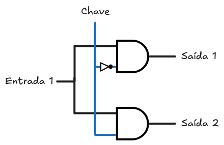

# Arquitetura de Computadores 1

## Boas fontes para estudar
- [Repositório de Arquitetura 1 - Raquel Motta](https://github.com/raksmotta/ARQ-COMP-1) -> Resumos e provas antigas do professor Cláudio

## Sumário
- [Mapa de Karnaugh](#Mapa-de-Karnaugh)
- [Universalidade das portas NAND e NOR](#Universalidade-das-portas-NAND-e-NOR)
- [Somadores e Subtratores](#Somadores-e-Subtratores)

## Mapa de Karnaugh

### 1) Montar o mapa

- Mapa de 3 variáveis

- Mapa de 4 variáveis

### 2) Montar grupos

- Queremos priorizar, nessa ordem: 
	- Menor número de grupos possível
	- Grupos grandes
	- Minimizar redundâncias (Sobreposição de grupos)
- Lembrar que grupos devem ser:
	- Retangulares (Sem formatos estranhos ou curvas)
	- Conter como número de elementos uma potência de 2 (1, 2, 4, 8...)

### 3) Montar a expressão a partir dos grupos
- Note que houve uma sobreposição entre os grupos. Isso não é um problema. Se fosse possível formar uma dupla com o mintermo 2 sem sobrepor a quadra, isso seria ideal.
- Agora, extraímos sub-expressões a partir dos grupos. Identificamos as variáveis que fazem parte da sub-expressão identificando as variáveis que são *relevantes* ao grupo
	- Uma variável é relevante quando ela "não muda" no grupo.
	- Por exemplo, na quadra da imagem, as variáveis X e Y não são relevantes à quadra.
- Agora que sabemos as variáveis relevantes, anotaremos elas como "normais" ou "negadas".
	- Se estivermos simplificando por Mintermos, variáveis de valor 1 serão "normais" e as de valor 0 serão "negadas". Se estivermos simplificando por Maxtermos, fazemos o oposto.
	- Se estivermos simplificando por Mintermos, organizaremos as sub-expressões como uma soma de produtos. Se estivermos simplificando por Maxtermos, organizaremos como um produto de somas.
- Da quadra roxa, podemos extrair a sub-expressão: `Z`
- Da dupla laranja, podemos extrair a sub-expressão: `X'.Y`
- Logo, a expressão final é `Z + (X' . Y)`

## Universalidade das portas NAND e NOR

### Lei de DeMorgan

- `( a . b )' = ( a' + b' )`
- `( a + b . c' )' = a' . ( b' + c)`
  Para aplicar a Lei de DeMorgan, basta inverter os sinais de todas as variáveis e trocar ANDs por ORs, e vice versa.

### Aplicando às portas NAND e NOR

Primeiro, negamos duas vezes a porta que desejamos obter.

- `( a . b ) = ( a . b )''`

Depois, utilizamos a Lei de DeMorgan para aplicar uma das negações:

- `( a . b )'' = ( a' + b' )'`

Como temos `(X+Y)'`, podemos reconhecer a porta NOR (Pois há uma operação OR negada)

Logo, para obter a porta AND a partir de NORs, basta negar os inputs da NOR

**Deduções de todas as portas no arquivo [Portas_Com_NAND_e_NOR.circ](./Portas_Com_NAND_e_NOR.circ)**

## Somadores e Subtratores

### Fundamentos

- A ideia é primeiro criar um "meio somador" ou "meio subtrator", que pode ser deduzido a partir da tabela verdade de uma soma ou subtração.
- Após criar a "meia" versão que recebe e retorna 2 bits, encadeamos duas metades para criar um somador/subtrator completo, ou somador/subtrator de 1 bit (Que recebe 3 bits e retorna 2)
- Tendo criado o somador/subtrator completo, basta encadear múltiplos para criar um somador/subtrator de N bits.
- **Exemplos de todos esses circuitos podem ser encontrados no arquivo [Somadores_Subtratores.circ](./Somadores_Subtratores.circ)**

## Multiplexadores

_Várias entradas para uma saída._

Os multiplexadores permitem a escolha de uma entrada dentre várias para ser propagada para a saída por meio de uma chave seletora:

Vejamos a tabela da saída:

| Chave | Saída     |
| ----- | --------- |
| 0     | Entrada 1 |
| 1     | Entrada 2 |

Perceba que a porta lógica `AND` bloqueia a passagem da entrada enquanto a chave não assumir um valor específico.

Além disso, a porta `OR` é capaz de unificar todas as entradas em uma única saída. Isso acontece pois ela propaga qualquer valor binário `1` que chegar em qualquer uma de suas entradas. Se sua saída corresponder ao valor binário `0`, significa que nenhuma entrada assumiu um valor diferente.

O tamanho da chave **em bits** dita a quantidade máxima de entradas que é capaz de gerenciar. Neste exemplo, temos uma chave de tamanho de 1 bit, assim gerenciando $2^1$ entradas.

No geral, uma chave seletora de N bits é capaz de gerenciar $2^N$ entradas. Vejamos um exemplo onde a chave possui tamanho de 2 bits.

Tabela de saída:

| Chave 2 | Chave 1 | Saída     |
| ------- | ------- | --------- |
| 0       | 0       | Entrada 1 |
| 0       | 1       | Entrada 2 |
| 1       | 0       | Entrada 3 |
| 1       | 1       | Entrada 4 |

## Demultiplexadores

_Uma entrada para várias saídas._

Diferente dos multiplexadores, os demultiplexadores permitem a escolha de uma saída dentre várias para propagar o sinal da entrada.

Tabela de saída:

| Chave | Saída 1 | Saída 2 |
| ----- | ------- | ------- |
| 0     | Entrada | 0       |
| 1     | 0       | Entrada |

As portas `AND` são usadas com o mesmo intuito dos multiplexadores, e dessa vez não há porta `OR`, pois em nenhum momento precisamos concentrar múltiplas entradas em uma única saída.

O tamanho da chave **em bits** dita a quantidade máxima de saídas que é capaz de gerenciar. Assim como nos multiplexadores, uma chave de N bits é capaz de gerenciar $2^N$ saídas.

Vejamos um demultiplexador com chave seletora de 2 bits:

Tabela de saída:

| Chave 2 | Chave 1 | Saída 1 | Saída 2 | Saída 3 | Saída 4 |
| ------- | ------- | ------- | ------- | ------- | ------- |
| 0       | 0       | Entrada | 0       | 0       | 0       |
| 0       | 1       | 0       | Entrada | 0       | 0       |
| 1       | 0       | 0       | 0       | Entrada | 0       |
| 1       | 1       | 0       | 0       | 0       | Entrada |
